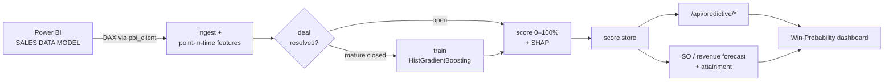

# CRM Win-Probability & Deal Prediction ML

[](https://github.com/rungrojcsi/CRM-Win-Probability-Deal-Prediction-ML/actions/workflows/ci.yml)

Scores every open opportunity 0–100% win probability with per-deal SHAP drivers, then rolls those scores up into Sales-Order / revenue forecasts and per-salesperson target attainment. Data is pulled live from the Power BI "SALES DATA MODEL" semantic model.

> **Status: pilot / ranking-grade.** Honest backtest: AUC 0.735, Brier 0.236, lift +7.7pp over baseline. The high band is still overconfident (predicted 96% → actual 72%). Use it to **rank** leads and shape forecasts, **not** for literal-% money decisions (~2.8/5, not decision-grade).
>
> **Internal use only — CSI GROUPS.** Real client names are never committed — docs, mocks, and fixtures use synthetic names.

Split from the `RAG_Azure` monorepo (2026-08). The legacy RAG pipeline now lives in [CRM-Hybrid-Adaptive-Agentic-RAG](https://github.com/rungrojcsi/CRM-Hybrid-Adaptive-Agentic-RAG).

## Business End-Users

**Primary users — CEO / COO / CFO.** A C-level view of pipeline health: which open deals will close, the probability-weighted revenue/SO forecast, and per-team target attainment — at a glance, backed by evidence rather than gut feel.

**The shift:** leadership forecasting moves from *a number assembled by hand each quarter* to a *model-backed, explainable read* that traces to individual deals and their odds.

## 1. Pain Points

Problems in sales pipeline management before this tool existed:

- **No objective read on which open deals will close** — prioritization ran on gut feel and the loudest salesperson, not on evidence from past deals.
- **Forecasts were a single number with no basis** — "we'll hit X this quarter" could not be traced to individual deals or their odds.
- **The reported win-rate was misleading** — Won deals close fast and Lost deals drag on, so recent quarters looked far healthier than they turn out to be.
- **No explanation per deal** — even when a deal "felt" weak, there was no consistent read on *why* (stalled activity, no BANT, aging).

## 2. Gap

| What the CRM already had | What was missing |
|--------------------------|------------------|
| Years of closed deals (Won/Lost) with activity, BANT, firmographics | No model learning from them to score open deals |
| SO Plan amounts + a goal per salesperson | No probability-weighted forecast or pacing view |
| An observed win-rate figure | No correction for right-censoring (it overstates reality) |
| Deal-level fields | No per-deal driver explanation an AE could act on |

## 3. Concept

A gradient-boosted classifier trained only on resolved deals, scoring open ones — with the numbers kept honest:

1. **Learn from mature closed deals** — label = Status (Won/Lost); train/eval only on cohorts past a maturity cutoff so slow-closing losses aren't undercounted
2. **Point-in-time features only** — every feature must be computable while the deal was still Open (no leakage)
3. **Explain every score** — per-deal SHAP drivers, so a low score comes with a reason
4. **Roll scores up, don't re-guess** — SO/revenue forecasts are Σ(amount × win-prob), derived from the same model, not a separate gut number
5. **Compute the score in code, report the backtest honestly** — deterministic metrics, and the README/CLAUDE.md state plainly that it is ranking-grade, not decision-grade

## 4. Where It Sits



## 5. Design

Design principles:

- **Point-in-time / no leakage is rule #1** — excluded features are documented with the numeric reason they hurt (e.g. `Possibility` =100 for all Won at close = label leakage; `Sales Cycle Days` not point-in-time). Do **not** re-add them naively.
- **Maturity cutoff fixes right-censoring** — Won P50 63d vs Lost P50 188d means recent cohorts undercount losses (observed win-rate ~60% vs real ~40%); `MATURITY_DAYS=540` trains/evals on resolved cohorts only.
- **Forecasts derive from the classifier** — SO monthly→yearly = realized actuals + Σ(SO Plan × win-prob); one source of truth, not a parallel guess.
- **Serving stays lean** — the read endpoints need only pandas; training/scoring (sklearn + shap) runs offline, never bloating the function runtime.
- **Test-first with synthetic fixtures** — the full suite runs with no live data and no Azure credentials.

### Models

| Model | File | What it does |
|-------|------|--------------|
| Win-Probability | `predictive/winprob.py` | HistGradientBoostingClassifier + SHAP, label = Status (Won/Lost), mature deals only |
| SO Monthly→Yearly Forecast | `predictive/so_forecast.py` | elapsed = realized SO Actual; future = Σ(SO Plan × win_prob) |
| Revenue Forecast | `predictive/forecast.py` | trailing-median + damped-trend |
| Target Attainment | `predictive/attainment.py` | per-salesperson pacing vs Fact_GoalMonth |

Three model variants (`predictive/schema.py`): `CRM_PDT_BASE` (22 features, default), `CRM_PDT_MIX` (+4 income-line features), `CRM_PDT_AZ` (label = P(opp → real Sales Order)).

## 6. Implementation (status)

| Item | Status |
|------|--------|
| Win-probability model + per-deal SHAP | ✅ Working |
| SO / revenue forecast + target attainment | ✅ Working |
| Ranked-deals + deal-detail API (`AuthLevel.FUNCTION`) | ✅ Working |
| Win-Probability dashboard (static site) | ✅ Working |
| Honest backtest harness (AUC / Brier / lift / calibration) | ✅ Working |
| Unit tests (synthetic fixtures) + CI | ✅ Green (123 tests) |
| High-band calibration (pred 96% → actual 72%) | ⏳ Known-overconfident — ranking-grade only |
| `/predictive/run` scoring in the lean function runtime | ⛔ Needs `requirements-ml.txt`; runs offline / on a trainer |

## Developer guide

### API (Azure Functions — `function-app`)

All routes are `AuthLevel.FUNCTION` (require a function key):

```
GET  /api/predictive/deals              ranked win-probability deals
GET  /api/predictive/deal/{opp_id}      one deal + SHAP drivers
POST /api/predictive/run                (re)score open opportunities
POST /api/predictive/backtest           honest backtest metrics
GET  /api/predictive/so-forecast        SO monthly→yearly forecast
GET  /api/predictive/forecast           revenue forecast
GET  /api/predictive/attainment         per-salesperson target pacing
```

> The serving runtime installs `requirements.txt` (pandas only) — the `deals/deal/forecast/attainment`
> endpoints work there. **Training/scoring** (`predictive.pipeline`, `/predictive/run`) needs
> `requirements-ml.txt` (scikit-learn + shap) and runs locally / on a trainer, not the lean runtime.

Data is pulled from Power BI via `transform/pbi_client.py` (the one module kept from the RAG repo — `predictive.ingest` wraps it).

### Structure

```
function-app/
  function_app.py           Azure Functions entry — predictive routes only
  predictive/               ML package (winprob, forecast, attainment, ingest, schema, store, api)
  predictive/dashboard/     static dashboard (index.html, app.js, styles.css) + mock_server.py
  transform/pbi_client.py   Power BI DAX client (only shared module kept from RAG_Azure)
  azureml/                  Azure ML scoring job (offline trainer)
  tests/                    unit tests — synthetic fixtures, no live data
docs/Predictive/            model briefs + SA design
```

### Dev

```bash
python -m venv .venv && source .venv/bin/activate
cd function-app
pip install -r requirements-ml.txt   # base + sklearn/shap for training & tests
pytest tests/ -q
```

PBI live read (local): `az account get-access-token --resource https://analysis.windows.net/powerbi/api` then run with `PBI_ACCESS_TOKEN=… PBI_CLIENT_SECRET=""`.

### Deploy

```bash
func azure functionapp publish function-app --build remote
```

Hosting: RG `RESOURCE_GROUP`, `southeastasia`, subscription "<subscription>". Dashboard is a static site on Azure Storage `$web` (`crmstorage`).
